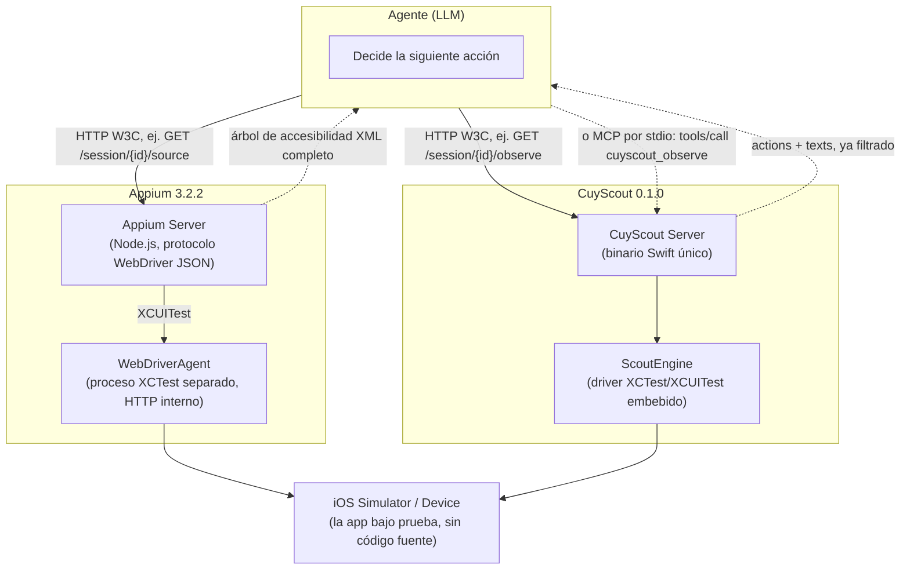
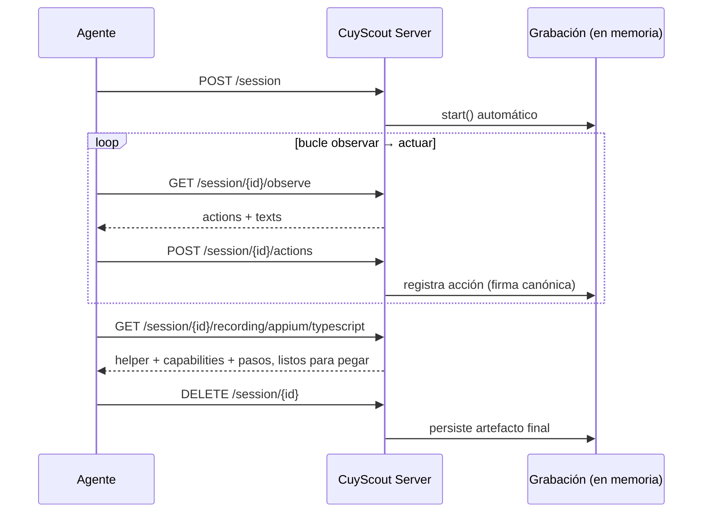

# Arquitectura: CuyScout frente a Appium

Las dos herramientas resuelven el mismo problema —automatizar una app iOS de la que el
agente no tiene el código fuente— con una cadena de procesos distinta. La diferencia de
coste medida en [`README.md`](../README.md) sale de aquí, no de un truco de prompting.

## Las dos cadenas

**Appium** es dos procesos: el servidor Appium habla el protocolo WebDriver con el
cliente, y por debajo levanta y mantiene **WebDriverAgent**, una app XCTest separada que
corre en el propio simulador y expone su propia API HTTP interna que Appium traduce.
Cada operación cruza ese salto extra.

**CuyScout** es un solo binario Swift. El servidor HTTP y el motor que conduce
XCTest/XCUITest (`ScoutEngine`) viven en el mismo proceso, y ese mismo proceso también
habla [MCP por `stdio`](../Sources/CuyScoutMCP/main.swift) — un agente que use un cliente
MCP (Claude Code, por ejemplo) no necesita ni siquiera hablar HTTP: llama
`cuyscout_observe` como si fuera una función.

## La diferencia que importa: qué transporta una lectura de pantalla

Ambas herramientas resuelven "qué hay en la pantalla ahora" de forma opuesta:

| | Appium: `GET /session/{id}/source` | CuyScout: `GET /session/{id}/observe` |
|---|---|---|
| Qué hace | WebDriverAgent vuelca el árbol de accesibilidad completo tal cual lo entrega XCTest | `ScoutEngine` recorre el mismo árbol y lo reduce a dos listas |
| Qué devuelve | XML/JSON con jerarquía, geometría (`x`, `y`, `width`, `height`) y cientos de contenedores anónimos de SwiftUI | `actions`: controles accionables con su selector semántico. `texts`: lo visible, con su identificador, para verificar |
| Quién decide qué es ruido | El agente, leyendo el árbol entero | El servidor, antes de responder |
| Coste medido (comprobante de pago) | 2 043 tokens (o hasta 8 994 de media en una corrida completa) | 284–367 tokens |
| Icon labels tipo `arrow.left.arrow.right.circle.fill` | Se incluyen, el agente los descarta él mismo | Filtrados por `ScoutEngine` antes de responder |

La separación `actions`/`texts` no es cosmética: `actions` es lo que el agente necesita
para **actuar** (qué tocar y con qué selector), `texts` es lo que necesita para
**verificar** (un monto, un código de operación, un mensaje de error) sin descargar
geometría que no va a usar.

## La otra pieza: qué tan barato es pedir la lectura barata

Tener una API compacta no sirve si el agente no sabe que existe. CuyScout resolvió esto
en dos capas adicionales, no solo en el servidor:

1. **Las descripciones de las herramientas MCP** (`Sources/CuyScoutMCP/main.swift`)
   dicen explícitamente cuál es la llamada normal y cuál es el último recurso —para un
   cliente que solo lee `tools/list`, esa descripción es toda la documentación que va a
   ver.
2. **La skill** (`.claude/skills/cuyscout-ios/SKILL.md`) empaqueta el bucle completo
   —observar, decidir, actuar, verificar— para que un agente no tenga que inferirlo de
   la guía entera.

La medición en el README muestra el efecto: antes de este cambio, un agente idéntico
pedía el árbol completo cinco veces por sesión porque la guía se lo indicaba; después,
cero veces.

## Sesión, grabación y prueba ejecutable

Una diferencia adicional, no de protocolo sino de ciclo de vida: en CuyScout,
**crear una sesión empieza a grabar automáticamente** (`CUYSCOUT_AUTORECORD`, por
defecto activo) y **cerrarla persiste el artefacto**. Cada acción queda con una firma
canónica estable (`JSONEncoder` con `.sortedKeys`), lo que además es lo que permite
detectar bucles de forma confiable.

En Appium no existe un equivalente: la prueba ejecutable, si el agente decide dejar una,
la escribe él a mano observando lo que hizo. Es el motivo por el que, en la segunda
medición del README, `recording/appium/typescript` cuesta ~900 tokens frente a un archivo
completo escrito desde cero.

## Ver también

- [`README.md`](../README.md) — números medidos, metodología y salvedades.
- [`docs/architecture.html`](architecture.html) — la misma comparación, en un diagrama
  visual.
- [`AGENT-GUIDE.md`](../AGENT-GUIDE.md) — el procedimiento paso a paso para un agente.
- [`.claude/skills/cuyscout-ios/SKILL.md`](../.claude/skills/cuyscout-ios/SKILL.md) — la
  skill empaquetada.
